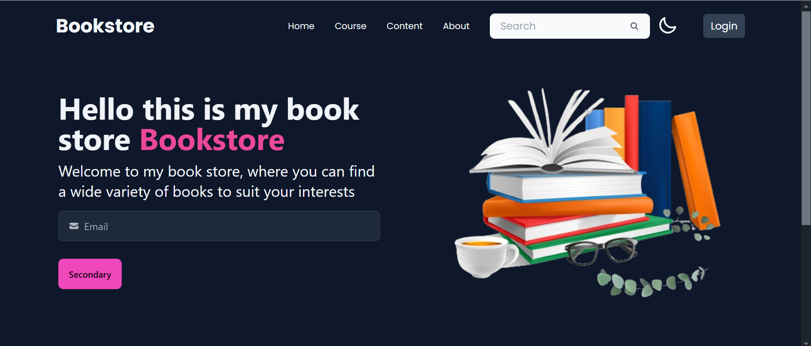

````markdown
# 📚 Online Bookstore

An online bookstore built using the **MERN stack** that allows users to access both free and premium books with secure authentication and personalized session management.

## 🚀 Features

- 🔐 Secure user authentication and session management  
- 📖 Browse a collection of free and premium books  
- 🧾 Personalized dashboard for each user  
- 🌐 Responsive UI built with Tailwind CSS  
- ⚡ Fast and scalable backend using Node.js and Express  
- 🗃️ Data stored in MongoDB  

## 🛠️ Tech Stack

- **Frontend**: React.js, Tailwind CSS  
- **Backend**: Node.js, Express.js  
- **Database**: MongoDB  
- **Authentication**: JWT (JSON Web Token), Sessions  

## 📸 Screenshots

### 🌑 Dark Mode



### 🌕 Light Mode


## ⚙️ Getting Started

### Prerequisites

- Node.js and npm  
- MongoDB (local installation or MongoDB Atlas)

### Installation

1. **Clone the repository:**

```bash
git clone https://github.com/your-username/online-bookstore.git
cd online-bookstore
````

2. **Install frontend and backend dependencies:**

```bash
# Backend
cd backend
npm install

# Frontend
cd ../frontend
npm install
```

3. **Set up environment variables:**

Create a `.env` file in the `backend` folder with the following values:

```env
MONGO_URI=your_mongodb_connection_string
JWT_SECRET=your_jwt_secret
```

4. **Start the development servers:**

```bash
# In backend
npm run dev

# In frontend
npm start
```

Your app should now be running:

* Frontend: `http://localhost:3000`
* Backend: `http://localhost:5000`

## 🙌 Contributing

Feel free to fork the repository, open issues, and submit pull requests to contribute.

## 📄 License

This project is licensed under the **MIT License**.

---

> Made with ❤️ using the MERN stack

```

```
